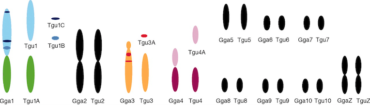

<style type="text/css">
slides > slide:not(.nobackground):after {
  content: '';
}
</style>

```{r setup, include=FALSE}
knitr::opts_chunk$set(echo = FALSE, dev.args = list(bg = 'transparent'))
```

```{r, echo=FALSE, warning=FALSE, include=FALSE}

# sfs plot

library('ggplot2')
library('gridExtra')
library('dplyr')

```

# Introduction

## Insertions and deletions

- short INDELs: sections of DNA < 50bp that are deleted or inserted in a genome
- deletion bias in most organisms
- deletions more deleterious than insertions

\  


## INDELs often overlooked

- Disproportionately occur in repetitive sequence
- Hard to align
- Often occur in hotspots
- 1/8 as frequent as SNPs in humans

\   
\  
\  
\  
\  
\  

<div style="position:absolute;bottom:4%;left:5%;width:450px;font-size:11pt;"> (Earl et al., 2014; Montgomery et al., 2013) </div>

## The importance of INDELs in genome evolution

* Influence genome size:
    * low deletion rate $\rightarrow$ large genomes?
    * high deletion rate $\rightarrow$ compact genomes?


\   
\  
\  
\  

<div style="position:absolute;bottom:4%;left:5%;width:900px;font-size:11pt;"> (Leushkin and Bazykin, 2013; Nam and Ellegren, 2012; Ometto et al., 2005; Sun et al., 2012) </div>


## The importance of INDELs in genome evolution

* Influence genome size:
    * low deletion rate $\rightarrow$ large genomes?
    * high deletion rate $\rightarrow$ compact genomes?


\   
\  
\  
\  

<div style="position:absolute;bottom:4%;left:5%;width:900px;font-size:11pt;"> (Leushkin and Bazykin, 2013; Nam and Ellegren, 2012; Ometto et al., 2005; Sun et al., 2012) </div>

## INDEL mutation


## INDEL selection

* Deletions
    *
  
* Insertions may be favoured:
    * biased gene conversion
    * minimum intron size
    * polarisation error
    
## Importance of polarisation error

```{R, echo=FALSE, warning=FALSE}
# data const
true_ins = data.frame(c(0.1, 0.2, 0.3, 0.4, 0.5, 0.6, 0.7, 0.8, 0.9), c(8, 4, 3, 2.5, 2, 1.8, 1.6, 1.5, 1.4))
colnames(true_ins) <- c('freq', 'prop')
true_ins$var = 'insertions'
true_ins$group = 'true'
true_del = data.frame(c(0.1, 0.2, 0.3, 0.4, 0.5, 0.6, 0.7, 0.8, 0.9), c(16, 8, 7, 5, 4, 3.5, 3, 2.9, 2.8))
colnames(true_del) <- c('freq', 'prop')
true_del$var = 'deletions'
true_del$group = 'true'

# insertion error
error_ins_1 = data.frame(c(0.1, 0.2, 0.3, 0.4, 0.5, 0.6, 0.7, 0.8, 0.9), c(2, 1, 0, 0, 0, 0, 0, 0, 0))
colnames(error_ins_1) <- c('freq', 'prop')
error_ins_1$var = 'insertions'
error_ins_1$group = 'ins_loss'
error_ins_2 = data.frame(c(0.1, 0.2, 0.3, 0.4, 0.5, 0.6, 0.7, 0.8, 0.9), c(0, 0, 0, 0, 0, 0, 0, 1, 2))
colnames(error_ins_2) <- c('freq', 'prop')
error_ins_2$var = 'deletions'
error_ins_2$group = 'del_gain'

#deletion error
error_del_1 = data.frame(c(0.1, 0.2, 0.3, 0.4, 0.5, 0.6, 0.7, 0.8, 0.9), c(4, 2, 0, 0, 0, 0, 0, 0, 0))
colnames(error_del_1) <- c('freq', 'prop')
error_del_1$var = 'deletions'
error_del_1$group = 'del_loss'
error_del_2 = data.frame(c(0.1, 0.2, 0.3, 0.4, 0.5, 0.6, 0.7, 0.8, 0.9), c(0, 0, 0, 0, 0, 0, 0, 2, 4))
colnames(error_del_2) <- c('freq', 'prop')
error_del_2$var = 'insertions'
error_del_2$group = 'ins_gain'

true_indel = rbind(true_del, true_ins, error_ins_1, error_ins_2, error_del_1, error_del_2)
ggplot(true_indel, aes(x=as.factor(freq), y=prop, fill=group)) + 
  geom_bar(stat='identity') +
  facet_wrap(~var) +
  theme_bw(base_size = 15) +
  xlab('Frequency of derived allele') + ylab('INDEL count') +
  scale_fill_manual(values=c('white', 'dark grey', 'white', 'dark grey', 'dark grey'), guide='none')

# del_gain, del_loss, ins_gain, ins_loss, true
```

<div style="position:absolute;bottom:4%;left:5%;width:900px;font-size:11pt;"> (see Hernandez et al., 2007) </div>

## Importance of polarisation error

```{R, echo=FALSE, warning=FALSE}
ggplot(true_indel, aes(x=as.factor(freq), y=prop, fill=group)) + 
  geom_bar(stat='identity') +
  facet_wrap(~var) +
  theme_bw(base_size = 15) +
  xlab('Frequency of derived allele') + ylab('INDEL count') +
  scale_fill_manual(values=c('white', 'dark grey', 'white', 'steel blue', 'dark grey'), guide='none')

# del_gain, del_loss, ins_gain, ins_loss, true
```

<div style="position:absolute;bottom:4%;left:5%;width:900px;font-size:11pt;"> (see Hernandez et al., 2007) </div>

## Importance of polarisation error

```{R, echo=FALSE, warning=FALSE}
ggplot(true_indel, aes(x=as.factor(freq), y=prop, fill=group)) + 
  geom_bar(stat='identity') +
  facet_wrap(~var) +
  theme_bw(base_size = 15) +
  xlab('Frequency of derived allele') + ylab('INDEL count') +
  scale_fill_manual(values=c('steel blue', 'dark grey', 'white', 'white', 'dark grey'), guide='none')

# del_gain, del_loss, ins_gain, ins_loss, true
```

<div style="position:absolute;bottom:4%;left:5%;width:900px;font-size:11pt;"> (see Hernandez et al., 2007) </div>

## Importance of polarisation error

```{R, echo=FALSE, warning=FALSE}
ggplot(true_indel, aes(x=as.factor(freq), y=prop, fill=group)) + 
  geom_bar(stat='identity') +
  facet_wrap(~var) +
  theme_bw(base_size = 15) +
  xlab('Frequency of derived allele') + ylab('INDEL count') +
  scale_fill_manual(values=c('steel blue', 'tomato 3', 'white', 'white', 'dark grey'), guide='none')

# del_gain, del_loss, ins_gain, ins_loss, true
```

<div style="position:absolute;bottom:4%;left:5%;width:900px;font-size:11pt;"> (see Hernandez et al., 2007) </div>

## Importance of polarisation error

```{R, echo=FALSE, warning=FALSE}
ggplot(true_indel, aes(x=as.factor(freq), y=prop, fill=group)) + 
  geom_bar(stat='identity') +
  facet_wrap(~var) +
  theme_bw(base_size = 15) +
  xlab('Frequency of derived allele') + ylab('INDEL count') +
  scale_fill_manual(values=c('steel blue', 'white', 'tomato 3', 'white', 'dark grey'), guide='none')

# del_gain, del_loss, ins_gain, ins_loss, true
```

<div style="position:absolute;bottom:4%;left:5%;width:900px;font-size:11pt;"> (see Hernandez et al., 2007) </div>

## Importance of polarisation error

```{R, echo=FALSE, warning=FALSE}
ggplot(true_indel, aes(x=as.factor(freq), y=prop, fill=group)) + 
  geom_bar(stat='identity') +
  facet_wrap(~var) +
  theme_bw(base_size = 15) +
  xlab('Frequency of derived allele') + ylab('INDEL count') +
  scale_fill_manual(values=c('dark grey', 'white', 'dark grey', 'white', 'dark grey'), guide='none')

# del_gain, del_loss, ins_gain, ins_loss, true
```

<div style="position:absolute;bottom:4%;left:5%;width:900px;font-size:11pt;"> (see Hernandez et al., 2007) </div>

## Aims - make more specific

1) Quanitfy the selective and mutational pressures acting on INDELs in great tits (*Parus major*)
2) Investigate how these pressures vary in different genomic contexts, ie coding, non-coding, recombination rate.


## Advantages of an avian system

- Conserved karyotype and synteny - good for alignments
- Genomes consist of few large macrochromosomes and many small microchromosomes
- Results in a highly dynamic recombination landscape - power to associations with recombination


\  
\ 



<div style="position:absolute;bottom:4%;left:5%;width:450px;font-size:11pt;"> (van Oers et al., 2014; Stapley et al., 2008) </div>

# Data

## Sample and pipeline

- 10 european great tit males (Corcoran et al., 2017)
- high coverage (44x)
- variant calling with GATK
- multispecies alignment between zebra finch, flycatcher and great tit
- parsimony based polarisation


# The model - 'anavar'

## A novel maximum likelihood approach

  * takes the unfolded site frequency spectrum
  * estimates for both insertions and deletions:
    * mutation rate ($\theta = 4N_e\mu$)
    * selection:
        * either selection coefficient ($\gamma = 4N_es$)
        * or scale and shape paramater for distribution of fitness effects
    * polarisation error
  * Controls for demography using neutral sites (Eyre-Walker et al., 2006)

<div style="position:absolute;bottom:4%;left:5%;width:450px;font-size:11pt;"> (Barton and Zeng, 2018) </div>

# Dataset summary

## Regional variation in purifying selection

```{r, echo=FALSE, warning=FALSE, message=FALSE}

library(ggplot2)
library(dplyr)
library(gridExtra)
library(viridis)

## divergence
div = read.delim('~/parus_indel/summary_analyses/gt_indel_div.txt')
snp_div = read.delim('~/parus_indel/summary_analyses/snp_div.txt', header=FALSE)
snp_div$variation = 'SNP'
snp_div = data.frame(cbind(as.character(snp_div$V1),snp_div$variation, snp_div$V2))
colnames(snp_div) = c('category', 'variation', 'divergence')
snp_div$divergence = as.numeric(as.character(snp_div$divergence))/10

div = subset(div, category!='noncoding' & category != 'UCNE' & category != 'ALL')
div = subset(div, select=c(category, variation, divergence))
div = rbind(div, snp_div)

div$category = factor(div$category,
  levels=rev(c('CDS', 'intergenic', 'introns', 'AR')))

div_plot = ggplot(div, aes(x=category, y=divergence, fill=variation)) +
    geom_bar(stat='identity', size=2, position = position_dodge(width=0.9)) +
    theme_bw(base_size = 15) +
    xlab('') + ylab('divergence') +
    theme(axis.text.x = element_text(angle = 45, hjust = 1),
    legend.title=element_blank(), legend.position='None',
    legend.background=element_blank()) +
    guides(colour = guide_legend(nrow = 1))+
    annotate("text", x = 3.5, y = 0.0065,
              label = '(SNPs: divergence x 10)', size=2.9) +
    scale_fill_viridis(discrete=TRUE)

## tajd
summary_data = read.delim('~/parus_indel/summary_analyses/bgi10_stats.txt', na=0)
call_data = read.delim('~/parus_indel/summary_analyses/bgi10_call.txt')

all_data = cbind(summary_data, call_data)

all_data[7] = NULL
all_data[7] = NULL

all_data$tw_per_site = all_data$theta_w / all_data$call
all_data$pi_per_site = all_data$pi / all_data$call

all_data = subset(all_data, category != 'noncoding_noUCNEs'
  & category != 'cds_frameshift' & category != 'cds_non_frameshift'
  & category != 'noncoding' & category != 'UCNE')

all_data$category = factor(all_data$category,
  levels=rev(c('CDS', '0fold', 'nonsense', '4fold', 'ALL', 'introns', 'intergenic', 'AR')))

# reset 0fold 4fold nonsense indel tajd to 0

# 0fold
all_data[2,]$tajD = NA
all_data[3,]$tajD = NA
all_data[4,]$tajD = NA
all_data[2,]$pi_per_site = NA
all_data[3,]$pi_per_site = NA
all_data[4,]$pi_per_site = NA
all_data[2,]$tw_per_site = NA
all_data[3,]$tw_per_site = NA
all_data[4,]$tw_per_site = NA

# 4fold
all_data[6,]$tajD = NA
all_data[7,]$tajD = NA
all_data[8,]$tajD = NA
all_data[6,]$pi_per_site = NA
all_data[7,]$pi_per_site = NA
all_data[8,]$pi_per_site = NA
all_data[6,]$tw_per_site = NA
all_data[7,]$tw_per_site = NA
all_data[8,]$tw_per_site = NA

# tajD
tajd = ggplot(all_data, aes(x=category, y=tajD, fill=variation))+
  geom_bar(stat='identity', position = position_dodge(width=0.9), size = 2) +
  theme_bw(base_size = 15) +
  xlab('')  + ylab("Tajima's D") +
  #ylim(-1.3, -0.2) +
  theme(legend.title=element_blank(), legend.position=c(0.3, 0.25),
  axis.text.x=element_text(angle=45, hjust=1)) +
  guides(fill=guide_legend(ncol=2))+ scale_fill_viridis(discrete=TRUE)

grid.arrange(tajd, div_plot, nrow=1)

```

# Coding INDELs

## INDELs predominantly strongly deleterious

```{R, echo=FALSE, warning=FALSE}
library(ggthemes)

pal = viridis(n=3)[1:3]

an_dat = read.csv('/Users/henryjuho/parus_indel/anavar_analyses/gt_cds_v_ar_indels_equal_t.aic.csv')

an_dat = subset(an_dat, delta_AIC==0 & sel_type == 'sel', select = c('theta', 'gamma', 'var_type', 'site_class', 'alpha'))

del_total = sum(subset(an_dat, var_type=='del')$theta)
ins_total = sum(subset(an_dat, var_type=='ins')$theta)

mute_total = data.frame(mute_total = c(del_total, ins_total, del_total, ins_total))

an_dat = cbind(an_dat, mute_total)
an_dat$mute_prop = an_dat$theta / an_dat$mute_total

mute_plot =  ggplot(an_dat, aes(x=toupper(var_type), y=theta*1000, group=site_class, fill=toupper(var_type), label=paste(round(mute_prop*100), '%'))) + 
  geom_bar(stat='identity', position='dodge') +
  theme_classic(base_size=15) + xlab('') +
  scale_fill_manual(values=pal) +
  geom_text(aes(y = theta*1000 + 0.02), position = position_dodge(0.9))+
  theme(legend.position = 'none', axis.text.x = element_blank()) +
  ylab(expression(theta * x *10^{-3}))

gamma_plot = ggplot(an_dat, 
                    aes(x=toupper(var_type), y=as.numeric(as.character(gamma)),
                        group=site_class, fill=toupper(var_type),
                        label=round(as.numeric(as.character(gamma)), 0))) + 
  geom_bar(stat='identity', position='dodge') +
  theme_classic(base_size=15) +
  scale_x_discrete(position = "top") + ylab(expression(gamma)) +
  theme(axis.text.x = element_blank(), axis.title.x = element_blank(),
        legend.position = 'none')+
  scale_fill_manual(values=pal) +
  geom_text(aes(y = as.numeric(as.character(gamma)) - 50), position = position_dodge(0.9))

alpha_plot = ggplot(an_dat, aes(x=var_type, y=alpha*100, 
                                fill=var_type, 
                                label=paste(round(as.numeric(as.character(alpha)), 2)*100, '%'))) +
  geom_bar(stat='identity', position='dodge') +
  geom_text(aes(y = as.numeric(as.character(alpha))*100 +5), 
            position = position_dodge(0.9)) +
  theme_classic(base_size=15) +
  xlab('') + ylab(expression(alpha)) +
  theme(axis.text.x = element_blank(), legend.position = 'bottom', legend.title = element_blank())+
  scale_fill_manual(values=pal, labels=c('Deletions', 'Insertions')) +
  guides(fill=guide_legend(nrow=1))

grid.arrange(grid.arrange(mute_plot, gamma_plot, nrow=2), alpha_plot, nrow=1)
```


# Moving away from coding regions

## Approach


## Approach


## Approach


## Approach


## Evidence for linked selection

```{R, echo=FALSE, warning=FALSE, message=FALSE}
library(gtools)

in_file = '~/parus_indel/gene_proximity_analyses/gt_nc_v_ar_2kb_wind_cds.results.csv'
window_size = 2

prox_data = read.csv(in_file)

prox_data$bin = factor(prox_data$bin, levels=mixedsort(as.character(subset(prox_data, sel_type=='sel' & var_type=='ins')$bin)))
prox_data$mean_gamma = as.numeric(as.character(prox_data$shape)) * as.numeric(as.character(prox_data$scale)) * -1
prox_data$distance = as.numeric(prox_data$bin) * window_size

ins_theta = subset(prox_data, sel_type == 'sel' & var_type == 'ins', select=c(bin, theta, distance))
colnames(ins_theta) = c('bin', 'ins_theta', 'distance')

#cor.test(as.numeric(ins_theta$ins_theta), ins_theta$distance, method='spearman', exact=NULL)
#length(ins_theta$distance)

del_theta = subset(prox_data, sel_type == 'sel' & var_type == 'del', select=c(bin, theta, distance))
colnames(del_theta) = c('bin', 'del_theta', 'distance')

#cor.test(as.numeric(del_theta$del_theta), del_theta$distance, method='spearman', exact=NULL)

rdi_data = as.data.frame(cbind(ins_theta, del_theta$del_theta))
rdi_data$rdi = rdi_data$del_theta / rdi_data$ins_theta

#cor.test(as.numeric(rdi_data$rdi), as.numeric(rdi_data$bin), method='spearman', exact=NULL)

theta_plot = ggplot(subset(prox_data, sel_type=='sel'), aes(x=distance, y=theta*10000, colour=toupper(var_type))) +
      geom_hline(yintercept=2.93, colour=pal[1], size=1, linetype=2) +
      geom_hline(yintercept=1.7, colour=pal[2], size=1, linetype=2) +
      geom_point(stat='identity', size = 2) +
      theme_bw(base_size = 15) +
      geom_smooth(method='lm', se=FALSE)+
      #xlim(0,10000)+
      ylab(expression(theta * x *10^-4))  + xlab('Distance from exons (kb)') +
      theme(legend.title = element_blank(), legend.position = c(0.15, 0.87), legend.background = element_blank()) +
      scale_colour_manual(values=pal)

theta_plot
```


# Recombination Analyses

## Getting the data


## Getting the data


## Getting the data


## Getting the data


## Getting the data - recombination rate

```{r, echo=FALSE}
library(gridExtra)
library(ggplot2)

# plotting recomb maps from linkage data
recomb_data <- read.delim('/Users/henryjuho/genomics/GT_recomb/recomb_model_data.txt')
new_recomb_data <- na.omit(recomb_data)
new_recomb_data <- new_recomb_data[grep('chr[[:digit:]]{1,2}$', new_recomb_data$CHR),]

ggplot(subset(new_recomb_data, CHR=='chr5'), aes(x = POS/1000000, y = RECOMB)) +
  geom_point() +
  stat_smooth(method="lm", se=FALSE, fill=NA, formula=y ~ poly(x, 3, raw=TRUE)) +
  theme_bw(base_size = 20) +
  labs(x='Physical position (Mb)', y='cM position')
```


## Getting the data


## Getting the data


## Getting the data


## Getting the data


## Association between diversity and recombination

```{R, echo=FALSE, warning=FALSE}
library(reshape2)
# summary stat results
window_data = read.delim('~/parus_indel/recombination_analyses/filtered_2Mb_windows.txt')

#cor.test(window_data$tajd_ins, window_data$rec_rate, method='spearman', exact=NULL)
#cor.test(window_data$tajd_del, window_data$rec_rate, method='spearman', exact=NULL)

# rdi data
rdi_data = subset(window_data, select=c(window, rec_rate, theta_ins, theta_del))
colnames(rdi_data) = c('window', 'rec_rate', 'ins', 'del')
rdi_data$rdi = rdi_data$del / rdi_data$ins
#cor.test(rdi_data$rdi, rdi_data$rec_rate, method='spearman', exact=NULL)
rdi_data$filter = 'No filter'

pal = viridis(n=3)[1:3]

# pi plot
pi_data = subset(window_data, select=c(window, rec_rate, pi_ins, pi_del))
colnames(pi_data) = c('window', 'rec_rate', 'ins', 'del')
pi_data = melt(pi_data, id=c('window', 'rec_rate'))
pi_data$variable = factor(pi_data$variable, levels=c('del', 'ins'))

pi_plot = ggplot(pi_data, aes(x=log(rec_rate + 1), y=value*10000, colour=toupper(variable))) +
      geom_point(stat='identity', size = 2) +
      geom_smooth(method='lm', se=FALSE) +
      theme_bw() +
      xlab('Recombination rate (log)')  + ylab(expression(pi * x *10^-4)) +
      theme(legend.position = 'none', plot.title=element_text(hjust=-0.2, vjust=-3)) +
      scale_colour_manual(values=pal)


# tajd plot
tajd_data = subset(window_data, select=c(window, rec_rate, tajd_ins, tajd_del))
colnames(tajd_data) = c('window', 'rec_rate', 'ins', 'del')
tajd_data = melt(tajd_data, id=c('window', 'rec_rate'))
tajd_data$variable = factor(tajd_data$variable, levels=c('del', 'ins'))

tajd_plot = ggplot(tajd_data, aes(x=log(rec_rate + 1), y=value, colour=toupper(variable))) +
      geom_point(stat='identity', size = 2) +
      geom_smooth(method='lm', se=FALSE) +
      theme_bw() +
      xlab('Recombination rate (log)')  + ylab("Tajima's D") +
      theme(legend.position=c(0.85, 0.15), legend.title=element_blank(), legend.background=element_blank(),
      plot.title=element_text(hjust=-0.3, vjust=-3))+
      scale_colour_manual(values=pal)

grid.arrange(pi_plot, tajd_plot, nrow=1)


## with filters

# summary stat results
window_data2 = read.delim('~/parus_indel/recombination_analyses/filtered_2Mb_windows_percentpol.txt')
window_data2 = subset(window_data2, pol_success > 0.6)

cor.test(window_data2$tajd_ins, window_data2$rec_rate, method='spearman', exact=NULL)
cor.test(window_data2$tajd_del, window_data2$rec_rate, method='spearman', exact=NULL)

# rdi plot
rdi_data2 = subset(window_data2, select=c(window, rec_rate, theta_ins, theta_del))
colnames(rdi_data2) = c('window', 'rec_rate', 'ins', 'del')
rdi_data2$rdi = rdi_data2$del / rdi_data2$ins
cor.test(rdi_data2$rdi, rdi_data2$rec_rate, method='spearman', exact=NULL)
rdi_data2$filter = '60% min polarised'

rdi_all = rbind(rdi_data, rdi_data2)


rdi_plot = ggplot(rdi_all, aes(x=log(rec_rate + 1), y=rdi)) +
      geom_point(stat='identity', size = 2) +
      geom_smooth(method='lm', se=FALSE) +
      theme_bw() +
      xlab('Recombination rate (log)')  + ylab('rDI') +
      theme(plot.title=element_text(hjust=-0.2, vjust=-3)) +
      facet_wrap(~filter, scale = 'free_x')


# pi plot
pi_data2 = subset(window_data2, select=c(window, rec_rate, pi_ins, pi_del))
colnames(pi_data2) = c('window', 'rec_rate', 'ins', 'del')
pi_data2 = melt(pi_data2, id=c('window', 'rec_rate'))
pi_data2$variable = factor(pi_data2$variable, levels=c('del', 'ins'))

pi_plot2 = ggplot(pi_data2, aes(x=log(rec_rate + 1), y=value*10000, colour=toupper(variable))) +
      geom_point(stat='identity', size = 2) +
      geom_smooth(method='lm', se=FALSE) +
      theme_bw() +
      xlab('Recombination rate (log)')  + ylab(expression(pi * x *10^-4)) +
      theme(legend.position = 'none', plot.title=element_text(hjust=-0.2, vjust=-3)) +
      ggtitle('(a)')+ scale_colour_manual(values=pal)


# tajd plot
tajd_data2 = subset(window_data2, select=c(window, rec_rate, tajd_ins, tajd_del))
colnames(tajd_data2) = c('window', 'rec_rate', 'ins', 'del')
tajd_data2 = melt(tajd_data2, id=c('window', 'rec_rate'))
tajd_data2$variable = factor(tajd_data2$variable, levels=c('del', 'ins'))

tajd_plot2 = ggplot(tajd_data2, aes(x=log(rec_rate + 1), y=value, colour=toupper(variable))) +
      geom_point(stat='identity', size = 2) +
      geom_smooth(method='lm', se=FALSE) +
      theme_bw() +
      xlab('Recombination rate (log)')  + ylab("Tajima's D") +
      theme(legend.position=c(0.85, 0.2), legend.title=element_blank(), legend.background=element_blank(),
      plot.title=element_text(hjust=-0.3, vjust=-3))+
      ggtitle('(b)') + scale_colour_manual(values=pal)
```


# Round up

## Conclusion

* INDELs in genes are bad
* Don't find a link between recombination rate and deletion bias
* Linked selection appears to be constraining INDEL rates

## Next steps

* Calculate alpha - proportion of substitutions fixed by positive selection
* Separate UCNE and CDS in linked selection analysis
* Any suggestions?

# Questions?